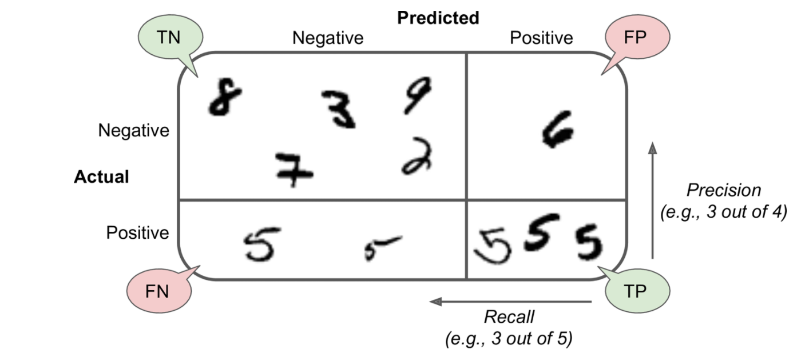

# 线性回归代码实现
## 一、线形回归-基本概念
> 回归分析是一种预测性的建模技术，它研究的是因变量（目标）和自变量（预测器）之间的关系。这种技术通常用于预测分析，时间序列模型以及发现变量之间的因果关系。通常使用曲线/线来拟合数据点，目标是使曲线到数据点的距离差异最小。

### 1. 定义与目标 🎯

线性回归是监督学习中最基础也最常用的回归算法，它通过建立因变量(目标变量)与一个或多个自变量(特征变量)之间的线性关系，来预测连续型的目标变量。

- **目标**：找到最佳的线性模型参数，使得模型的预测输出与实际观测值之间的误差最小
- **适用场景**：当我们认为自变量和因变量之间存在近似线性关系时
- **本质**：线性回归是一种参数化模型，通过学习数据中的统计规律来估计模型参数

### 2. 基本假设

线性回归模型建立在以下几个关键假设之上：

1. **线性关系假设**：自变量与因变量之间存在线性关系
2. **误差项独立性假设**：所有观测样本的误差项相互独立
3. **等方差性假设(同方差假设)**：误差项的方差在所有自变量取值下保持不变
4. **正态分布假设**：误差项服从均值为零的正态分布 $\varepsilon \sim N(0, \sigma^2)$
5. **无多重共线性**：自变量之间不存在严格的线性相关性
6. **误差期望为零**：E(ε)=0

### 3. 线性回归分类

1. **简单线性回归**：仅有一个自变量x和一个因变量y  ➡️ $y = \beta_0 + \beta_1 x + \varepsilon$
2. **多元线性回归**：有多个自变量和一个因变量          ➡️ $y = \beta_0 + \beta_1x_1 + \beta_2x_2 + ... + \beta_px_p + \varepsilon$其中：
    - β0,β1,...,βp是回归系数
    - x1,x2,...,xp 是自变量
    - ε是误差项

### 4.**线性回归模型公式**

1. 矩阵形式   ➡️  $y = X\beta + \varepsilon$
    - Y 是 *n*×*q* 矩阵，表示 *n* 个样本的 *q* 个因变量
    - X 是 *n*×(*p*+1) 矩阵，表示 *n* 个样本的 *p* 个自变量加一列常数项1
    - $\beta$ 是 (*p*+1)×*q* 系数矩阵
    - ε 是 *n*×*q* 误差矩阵

     $\begin{pmatrix} y_{i1} \\ y_{i2} \\ \vdots \\ y_{iq} \end{pmatrix} = \begin{pmatrix} \beta_{01} & \beta_{11}x_{i1} & \beta_{21}x_{i2} & \cdots & \beta_{p1}x_{ip} \\ \beta_{02} & \beta_{12}x_{i1} & \beta_{22}x_{i2} & \cdots & \beta_{p2}x_{ip} \\ \vdots & \vdots & \vdots & \ddots & \vdots \\ \beta_{0q} & \beta_{1q}x_{i1} & \beta_{2q}x_{i2} & \cdots & \beta_{pq}x_{ip} \end{pmatrix} + \begin{pmatrix} \varepsilon_{i1} \\ \varepsilon_{i2} \\ \vdots \\ \varepsilon_{iq} \end{pmatrix}$

### 5. 应用场景

线性回归广泛应用于多个领域：

- 经济学：预测销售额、价格变动等
- 医学研究：分析药物剂量与效果的关系
- 社会科学：研究各种因素对社会现象的影响
- 工程学：预测系统响应和性能
- 金融领域：资产定价和风险评估

### 6. **线性回归模型**优缺点

**优点：**
- 模型简单直观，易于理解和解释
- 计算效率高，训练速度快
- 不需要特别调整即可获得合理结果
- 可作为更复杂模型的基准

**缺点：**
- 只能捕捉线性关系，对非线性关系建模能力弱
- 对异常值敏感
- 假设条件较为严格，现实中可能不完全满足
- 自变量间存在多重共线性时，估计不稳定

## 二、线性回归-模型数学表达

### 1 模型公式

#### **1.1 简单线性回归模型**

**公式** ➡️ $y = \beta_0 + \beta_1 x + \varepsilon$ ，其中：

- y 为因变量(目标变量)： 需要预测的值
- x 为自变量(特征变量)： 用于预测的输入变量
- β0 为截距项： 表示x=0时y的值
- β1 为斜率系数：表示x变化一个单位时y的变化量
- ε为误差项：表示模型无法解释的随机误差

#### **1.2 多元线性回归模型**

**公式** ➡️  $h_\theta(x) = \theta_0 + \theta_1x_1 + \theta_2x_2 = \sum_{i=0}^{n} \theta_i x_i = \theta^T x$，其中：

- θ = [θ₀, θ₁, ..., θₙ]ᵀ 是参数向量
- x = [1, x₁, ..., xₙ]ᵀ 是输入向量（注意x₀=1）

### 2.损失函数

**损失函数（loss function）**能够**量化目标的*实际*值与*预测*值之间的差距**。 通常我们会选择非负数作为损失，且数值越小表示损失越小，完美预测时的损失为0。 回归问题中最常用的损失函数是平方误差函数。

#### 2.1 损失函数计算示例

| 面积(x) | 实际价格(y) | 预测价格(h(x)) | 差异 | 平方差 |
| --- | --- | --- | --- | --- |
| 50平米 | 100万 | 90万 | -10万 | 100 |
| 80平米 | 150万 | 160万 | +10万 | 100 |
| 110平米 | 200万 | 185万 | -15万 | 225 |

损失计算：

- 总平方差 = (-10)²+ (+10)² +(-15)²  =100 + 100 + 225 = 425
- 均方差(MSE) = 425/(2×3) ≈ 70.8

#### 2.2 损失函数公式推导

**均方误差 MES：**预测值与实际值差的平方和的平均值

目标函数是优化问题中需要最大化或最小化的函数。它用数学表达式表示我们要优化的目标。

**步骤一： 求高斯函数的密度函数**

真实值和预测值之间肯定是要存在差异的 （用： $\epsilon$ 来表示该误差）

For each sample: $y^{(i)} = \theta^T x^{(i)} + \epsilon^{(i)}$

- y(i) 是第i个观测值
- x(i) 是第i个输入特征向量
- θ 是模型参数
- ε(i) 是误差项

误差的分布假设：误差项ε(i)服从高斯分布（正态分布），概率密度函数为：

$$
p(\varepsilon^{(i)}) = \frac{1}{\sqrt{2\pi\sigma^2}} \exp(-\frac{(\varepsilon^{(i)})^2}{2\sigma^2})
$$

**步骤二： 条件概率推导:**

**步骤三：计算似然函数**

- 由于所有样本都是独立的
- 总的似然函数是各个样本概率的乘积：

$L(\theta) = \prod_{i=1}^m p(y^{(i)}|x^{(i)};\theta)= \prod_{i=1}^m \frac{1}{\sqrt{2\pi\sigma^2}} \exp(-\frac{(y^{(i)} - \theta^T x^{(i)})^2}{2\sigma^2})$

取对数简化计算

- 将乘法转换为加法，简化计算
- 对数函数是单调递增的，最大值点不变
- 可以避免数值下溢问题

$L(\theta) =\sum_{i=1}^m \log \frac{1}{\sqrt{2\pi\sigma}} \exp(-\frac{(y^{(i)} - \theta^T x^{(i)})^2}{2\sigma^2})=\sum_{i=1}^m [\log \frac{1}{\sqrt{2\pi\sigma}} + \log \exp(-\frac{(y^{(i)} - \theta^T x^{(i)})^2}{2\sigma^2})] =\sum_{i=1}^m [\log \frac{1}{\sqrt{2\pi\sigma}} + (-\frac{(y^{(i)} - \theta^T x^{(i)})^2}{2\sigma^2})]=\sum_{i=1}^m \log \frac{1}{\sqrt{2\pi\sigma}} + \sum_{i=1}^m (-\frac{(y^{(i)} - \theta^T x^{(i)})^2}{2\sigma^2})=m \log \frac{1}{\sqrt{2\pi\sigma}} - \frac{1}{2\sigma^2} \sum_{i=1}^m (y^{(i)} - \theta^T x^{(i)})^2$

忽略常数项 $m \log \frac{1}{\sqrt{2\pi\sigma}}$ ,以及$-\frac{1}{2\sigma^2}$（（因为σ²为常数）

**最终得到最小二乘损失函数:$L(\theta) = \frac{1}{2} \sum_{i=1}^m (y^{(i)} - \theta^T x^{(i)})^2$**

**最终结果：目标函数以及偏导数**

目标函数: $J(\theta)=\frac{1}{2}\sum_{i=1}^m(h_\theta(x^{(i)})-y^{(i)})^2=\frac{1}{2}(X\theta-y)^T(X\theta-y)=\theta^TX^TX\theta-\theta^TX^Ty-y^TX\theta+y^Ty$

求偏导数为0：

$X^TX\theta-X^Ty=0$

$X^TX\theta=X^Ty$

$\theta=(X^TX)^{-1}X^Ty$

---

**公式** ➡️ **(MSE均方误差)** $J(θ) = \frac{1}{2m} \sum_{i=1}^m (h_\theta(x^{(i)}) - y^{(i)})^2 =\frac{1}{2m} (Xθ - y)^T(Xθ - y)$

- m 是训练样本数量
- $h_θ(x^{(i)})$ *是第i个样本的预测值*
- $y^{(i)}$是第i个样本的真实值
- *θ 是模型参数向量*
    - X 是 m×(n+1) 的特征矩阵
    - y 是 m×1 的目标值向量
    - θ 是 (n+1)×1 的参数向量

#### 2.3 优化目标

在线性回归中，我们的核心目标是找到最优的模型参数，使预测值与真实值之间的误差最小。这通过最小化损失函数来实现。

- 线性回归的目标是找到参数向量β，使损失函数最小化：

 $\min_{\beta} J(\beta) = \min_{\beta} \frac{1}{n}(y-X\beta)^T(y-X\beta)$,这个公式表示最小二乘法的优化目标，其中：

- $\min_{\beta}$表示对参数 *β* 求最小值
- $\frac{1}{n}$是归一化因子
- $(y-X\beta)^T(y-X\beta)$是残差的平方和

这个最小化问题的解就是多元线性回归的参数估计值。